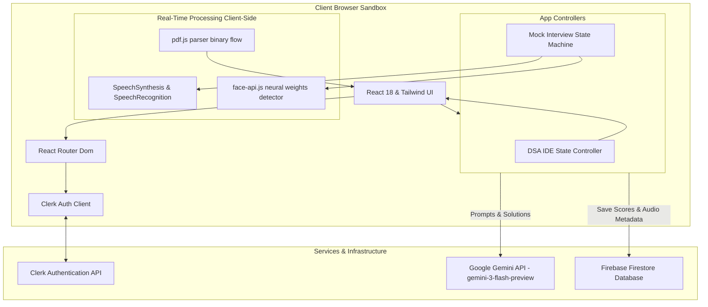

# 🎙️ Dynamic AI Mock Interview & Career Acceleration Hub

Welcome to the **Dynamic AI Mock Interview & Career Acceleration Hub**—a comprehensive, browser-based mock assessment, live-coding, and career coaching platform designed to prepare candidates for competitive engineering roles.

Built with a modern web design system, the application transitions from standard static interview practices into an immersive, real-time preparation playground. It combines voice-guided simulations, client-side webcam gaze/emotion tracking, an interactive macOS-style DSA playground, resume ATS match compilers, salary negotiation roleplay, and structured career roadmaps.

---

## 🌟 Core Services & Features

### 1. 🗣️ Voice-Guided Mock Interview Simulator
* **Text-to-Speech (TTS)**: The AI interviewer read out welcome prompts, introductions, and questions dynamically using high-fidelity native browser synthesis (`SpeechSynthesis`).
* **Speech-to-Text (STT)**: Automatically captures and records voice responses following question narration, allowing hands-free practice.
* **AI Transcript Correction**: Runs an automated corrector pass via the Google Gemini API to resolve speech engine phonetic typos, syntax slips, and grammar errors while preserving technical nomenclature.
* **Behavioral Feedback Panel**: Grades response quality, compares candidate answers to model solutions, and rates performance on a 1-10 scale.

### 2. 💻 Real-Time DSA Coding Playground
* **Multi-Question Workspace**: Simulates a live technical interview environment with tabbed navigation supporting up to 3 problems per session.
* **Target Company Tiers**: Calibrates question generation specifically for:
  * **FAANG / MAANG** (Google, Meta, Apple, Netflix, Amazon)
  * **Tier-1 Tech Giants** (Stripe, Uber, Airbnb, ByteDance)
  * **High-Growth Startups & MNCs** (Walmart, Cisco, Siemens)
* **Adaptive Timers**: Set difficulty-bound countdown timers (Easy: 15m/qst, Moderate: 35m/qst, Hard: 60m/qst) that automatically auto-submit solutions upon expiration.
* **macOS-Style Dark IDE**: Includes code editors with line numbering, resets, language selectors (JavaScript, TypeScript, Python, Java, C++), and visual pulse notifications for low-time conditions.
* **AI Evaluation Engine**: Gemini evaluates submissions for overall scores, correctness, time/space complexity ($O$-notation), and provides targeted refactoring recommendations.

### 3. 📄 Resume ATS Matcher & Parser
* **Client-Side PDF/TXT Parser**: Seamlessly drag-and-drop or browse resume files (`.pdf`, `.txt`). The platform extracts file contents locally inside the sandbox using `pdf.js`.
* **Job Description Suitability Score**: Analyzes your resume against target job postings to return a suitability match percentage.
* **Section-Wise Analysis**: Delivers individual reviews and match ratings (Strong, Needs Improvement, Weak) for *Work Experience, Skills & Technologies, Projects, and Formatting*.
* **Optimization Tools**: Highlights missing keywords from the job description and generates before/after bullet-point phrasing rewrites with action verbs.

### 4. 💬 Salary Negotiation Coach
* **AI Recruiter Roleplay**: Simulates a hard-line, realistic negotiation with an HR Recruiter based on your target company, role title, and base offer salary.
* **Interactive Negotiation Logs**: Helps you practice response pacing, justifying compensation demands, balancing equity tradeoffs, and securing concessions.

### 5. 🗺️ Career Roadmap Coach
* **Custom Learning Curricula**: Generates structured, milestone-based development roadmaps aligned to your current experience and dream companies.
* **Portfolio Blueprinting**: Suggests specific portfolio projects, technical stacks to study, and phase-by-phase execution goals.

### 6. 🛡️ Integrity Verification & Emotion Analytics
* **Mandatory Webcam Precheck**: Verifies camera availability and candidate alignment before sessions begin.
* **Gaze & Focus Monitor**: Freezes timers and displays a full-screen warning overlay if the candidate looks away, covers the lens, or switches tabs during mock interviews.
* **Composure Tracking**: Employs client-side face expression detection (`face-api.js`) to log composure patterns (focused, neutral, stressed) and output analytics charts on the feedback panel.

---

## 🛠️ Technology Stack

| Component | Technology | Description |
| :--- | :--- | :--- |
| **Frontend Framework** | React 18, TypeScript, Vite | Fast, type-safe development environment with hot reloading |
| **Styling & Icons** | Tailwind CSS, Lucide Icons | HSL design tokens, responsive cards, glassmorphism, and transition animations |
| **Authentication** | Clerk Auth | Secure user sign-ups, sign-ins, and session states |
| **Database** | Firebase Firestore | Cloud database for interview templates, historical results, and user settings |
| **AI SDK** | Google Gen AI SDK (`@google/genai`) | Prompts Gemini for code parsing, ATS comparison, and conversational coaching |
| **Document Parsing** | pdf.js (CDN loaded) | Localized PDF array-buffer binary text extraction |
| **Face Tracking** | face-api.js (vladmandic CDN) | Client-side facial landmark detection and composure analytics |

---

## 📂 Project Structure

```text
├── src/
│   ├── components/
│   │   ├── ui/                       # Reusable styling & shadcn primitive libraries
│   │   ├── custom-bread-crumb.tsx    # Responsive breadcrumb navigation
│   │   ├── dynamic-interview.tsx     # CORE: Mock Interview state machine, voice & gaze tracking
│   │   ├── form-mock-interview.tsx   # Configures and templates new interview modules
│   │   └── pin.tsx                   # Interactive security pin overlay
│   ├── routes/
│   │   ├── index.ts                  # Routing path declarations
│   │   ├── mock-interview-page.tsx   # Container for live interview sessions
│   │   ├── feedback.tsx              # Detailed post-interview grading & composure analytics
│   │   ├── mock-load-page.tsx        # Camera pre-checking and preview window
│   │   ├── services.tsx              # Services landing page
│   │   └── dashboard.tsx             # CORE: Tab-based Services Hub & DSA IDE workspace
│   ├── hooks/
│   │   └── useFaceApi.ts             # Lazily loads face-api weights and classifiers from CDN
│   ├── config/
│   │   └── firebase.config.ts        # Initializes connection to Firebase DB
│   ├── scripts/
│   │   └── index.ts                  # Configures Gemini SDK and chatSession handlers
│   ├── types/
│   │   └── index.ts                  # Centralized TypeScript declarations
│   ├── App.css
│   ├── index.css                     # Design systems, gradients, and keyframes
│   └── main.tsx                      # Vite React mounting point
├── .env                              # API credentials configurations
├── package.json
└── vite.config.ts
```

---

## 🚀 Installation & Local Setup

Follow these steps to configure and run the project locally:

### 1. Prerequisites
Ensure you have **Node.js** (v18+) and **pnpm** (or `npm`) installed.

### 2. Clone the Repository
```bash
git clone https://github.com/prathamesh-pichkate/Real-Time-AI-Interview-Trainer.git
cd Real-Time-AI-Interview-Trainer
```

### 3. Install Dependencies
```bash
pnpm install
# or
npm install
```

### 4. Configure Environment Variables
Create a `.env` file in the root directory and supply your respective API credentials:

```ini
# Clerk Authentication Configuration
VITE_CLERK_PUBLISHABLE_KEY=your_clerk_publishable_key

# Firebase SDK Credentials
VITE_FIREBASE_API_KEY=your_firebase_api_key
VITE_FIREBASE_AUTH_DOMAIN=your_firebase_auth_domain
VITE_FIREBASE_PROJECT_ID=your_firebase_project_id
VITE_FIREBASE_STORAGE_BUCKET=your_firebase_storage_bucket
VITE_FIREBASE_MESSAGING_SENDER_ID=your_firebase_messaging_sender_id
VITE_FIREBASE_APP_ID=your_firebase_app_id

# Google Gemini API Config
VITE_GEMINI_API_KEY=your_gemini_api_key
```

### 5. Launch the Application
```bash
pnpm dev
# or
npm run dev
```
Open [http://localhost:5173](http://localhost:5173) in your browser.

### 6. Build Production Bundle
To compile and package the assets for production deployment:
```bash
pnpm build
# or
npm run build
```

---

## 🏗️ High-Level Design (HLD)

The Dynamic AI Mock Interview & Career Acceleration Hub is designed as a client-first, cloud-supported single page application (SPA). Client-side processing is maximized to ensure low-latency interactions (gaze checking, voice synthesis, resume text parsing), while the cloud layer handles persistence and large language model inference.

### 1. Architectural Diagram



### 2. Component Architecture & Data Flow

#### A. Interactive Mock Interview Loop
1. **Trigger**: User configures and starts a session.
2. **Setup**: Precheck verifies webcam access. The system loads `face-api.js` detector weights.
3. **Loop**:
   - `SpeechSynthesis` reads the question out loud.
   - On completion, `SpeechRecognition` begins recording.
   - Client-side face tracker logs candidate composure at 5fps.
   - If user focus drifts away from the screen, the state engine pauses recording and displays a blurred focus loss mask.
4. **Transition**: When the response countdown finishes or the user clicks "Next", the transcript is saved.
5. **AI Correction**: Gemini sanitizes phonetically corrupted transcripts.
6. **Save**: The final answers are written to Firestore.

#### B. Timed DSA Practicing System
1. **Generation**: The user specifies topics, languages, company tiers, and question count.
2. **Calibrator**: The playground calls Gemini, requesting a formatted JSON array of coding challenges.
3. **Execution**: The user writes code in a macOS-styled dark terminal. 
4. **Submission**: Solutions are sent to Gemini to generate time/space complexity assessments, correctness percentages, and optimization suggestions.

#### C. Local Resume ATS Suitability Matcher
1. **Extraction**: A file input event loads a `.pdf` or `.txt` resume. `pdf.js` extracts text in-memory.
2. **Analysis**: The text, along with the job description, is sent to Gemini.
3. **Feedback**: Gemini returns a JSON object outlining overall scores, section evaluations, and optimized bullet point rewrites.

---

## 📐 Low-Level Design (LLD)

This section outlines data structures, TypeScript interfaces, system state machines, API keys, database models, and prompt schemas.

### 1. Database Schema (Firebase Firestore)

The application uses Firebase Firestore as its persistence layer. The core schemas are structured as follows:

#### Collection: `interviews`
```typescript
interface InterviewRecord {
  id?: string;                    // Firestore auto-generated document ID
  userId: string;                 // Clerk user identifier
  position: string;               // Target job role (e.g. Software Engineer)
  description: string;            // Target job description
  techStack: string;              // Key technologies (e.g. React, Node.js)
  experience: number;             // Years of experience (e.g. 3)
  difficulty: "Easy" | "Moderate" | "Hard";
  questions: Array<{
    question: string;             // The question read by the AI
    answer: string;               // Model reference answer
  }>;
  createdAt: Timestamp;           // Creation timestamp
  updatedAt?: Timestamp;
}
```

#### Collection: `answers` (Associated feedback)
```typescript
interface UserAnswerFeedback {
  id?: string;
  interviewId: string;            // Reference to interview record
  question: string;               // The question asked
  userAnswer: string;             // Raw transcribed candidate answer
  correctedAnswer: string;        // Gemini corrected and polished transcript
  feedback: string;               // AI feedback and recommendations
  rating: number;                 // Answer score on a 1-10 scale
  composureLog?: Array<{          // Compiled facial tracking composure data
    focused: number;              // Percentage focused
    neutral: number;
    stressed: number;
  }>;
  createdAt: Timestamp;
}
```

### 2. Core Interfaces & Types

#### DSA Challenge Session State
```typescript
export interface DsaQuestion {
  title: string;
  description: string;
  company: string;
  starterCode: string;
}

export interface DsaFeedback {
  score: number;                  // Overall performance score percentage
  verdict: string;                // "Strong Pass", "Pass", "Fail"
  review: string;                 // High-level synthesis review
  individualFeedbacks: Array<{
    title: string;
    correctness: string;          // Correctness notes
    timeComplexity: string;       // Big-O complexity (e.g., O(NlogN))
    spaceComplexity: string;      // Big-O space complexity (e.g., O(1))
    improvements: string;         // Optimization tips
  }>;
}
```

#### Resume ATS Suitability Report State
```typescript
export interface AtsReport {
  score: number;                  // Compatibility score percentage
  sections: Array<{
    name: string;                 // "Work Experience", "Projects", etc.
    rating: "Strong Match" | "Needs Improvement" | "Weak Match";
    feedback: string;             // Section improvement directions
  }>;
  missingKeywords: string[];      // Keywords missing from JD
  bulletRewrites: Array<{
    before: string;               // Original bullet
    after: string;                // ATS-optimized bullet
  }>;
  advice: string;                 // Formatting and alignment suggestions
}
```

### 3. API Key Mapping & Environment Configuration

| API Key Identifier | Source Service | Scope of Usage |
| :--- | :--- | :--- |
| `VITE_CLERK_PUBLISHABLE_KEY` | Clerk Auth Service | Renders `<SignIn />`, `<SignUp />`, and tracks session tokens client-side. |
| `VITE_FIREBASE_API_KEY` to `_APP_ID` | Google Firebase Firestore | Performs Firestore queries (`addDoc`, `updateDoc`, `onSnapshot`) to persist data. |
| `VITE_GEMINI_API_KEY` | Google Developer Console | Powers the `GoogleGenAI` client for live question generation and grading. |

### 4. Prompt Engineering & System Prompts

#### A. Technical Transcript Correction Prompt
```text
Role: Technical Speech Transcript Correction Assistant
Instruction: Take the phonetically generated speech-to-text transcript and correct any grammatical errors, spelling mistakes, and technical vocabulary mishearings.
Rules:
- Do not summarize the answer.
- Do not evaluate or grade the answer.
- Return ONLY the corrected transcript.
```

#### B. Resume ATS Suitability Prompt
```text
Compare the candidate's resume text against the target job description.
Candidate Resume: {atsResume}
Target Job Description: {atsJobDesc}

Provide your feedback in a clean JSON format with these exact keys:
{
  "score": 78,
  "sections": [
    { "name": "Work Experience", "rating": "Needs Improvement", "feedback": "Feedback..." }
  ],
  "missingKeywords": ["Skill A"],
  "bulletRewrites": [
    { "before": "Before...", "after": "After..." }
  ],
  "advice": "General advice..."
}
Return ONLY this JSON object. No surrounding markdown backticks.
```

---

## 🔒 Privacy & Safety Policies
All video captures, facial bounding calculations, and emotional classification algorithms are processed **exclusively client-side** inside the candidate's browser sandbox via WebGL acceleration. **No video feed or raw images are uploaded, sent, or saved** to any cloud server or third-party AI provider. Only anonymized metadata statistics (e.g., composure percentage averages) are saved to Firebase Firestore to populate candidate dashboards.

